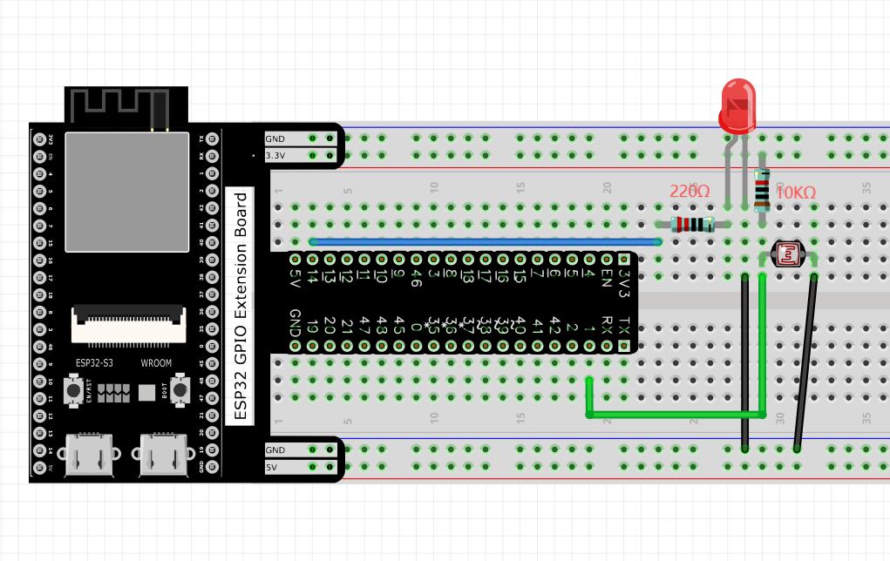

Chapter 11 Photoresistor & LED
=====================================
In this chapter, we will learn how to use a photoresistor.

Project 11.1 NightLamp
------------------------

A photoresistor is very sensitive to the amount of light present. We can take 
advantage of the characteristic to make a nightlight with the following function: 
when the ambient light is less (darker environment) the LED will automatically 
become brighter to compensate and when the ambient light is greater (brighter environment) 
the LED will automatically dim to compensate.

Component List
^^^^^^^^^^^^^^^
- ESP32-S3-WROOM x1
- GPIO Extension Board x1
- 830 Tie-Points Breadboard x1
- Resistor 10kΩ  x1
- Resistor 220Ω  x1
- Photoresistor x1
- LED x1
- Jumper Wire x4
  
Connect
^^^^^^^^^^^
The circuit of this project is similar to project Soft Light. The only difference 
is that the input signal is changed from a potentiometer to a combination of a 
photoresistor and a resistor.

Sketch
^^^^^^^
The circuit used is similar to the project Soft Light. The only difference is that 
the input signal of the pin of ADC changes from a potentiometer to a combination 
of a photoresistor and a resistor.

**Sketch_11.1_Nightlamp**

Download the code to ESP32-S3 WROOM, if you cover the photoresistor or increase 
the light shining on it, the brightness of the LED changes accordingly.

Code
^^^^^^
The following is the program code:

.. code-block:: C

    const byte adcChns[] = {12, 13, 14};    // define the adc channels
    const byte ledPins[] = {38, 39, 40};    // define led pins
    const byte pwmChns[] = { 0,  1,  2};    // define the pwm channels
    int colors[] = {0, 0, 0};               // red, green ,blue values of color.
    void setup() {
    for (int i = 0; i < 3; i++) {         //setup the pwm channels
        ledcAttachChannel(ledPins[i], 1000, 8, pwmChns[i]);//1KHz, 8bit(0-255).
    }
    }

    void loop() {
    for (int i = 0; i < 3; i++) {
        colors[i] = map(analogRead(adcChns[i]), 0, 4096, 0, 255); //calculate color value.
        ledcWrite(ledPins[i], 256 - colors[i]);                   //set color
    }
    delay(10);
    }

