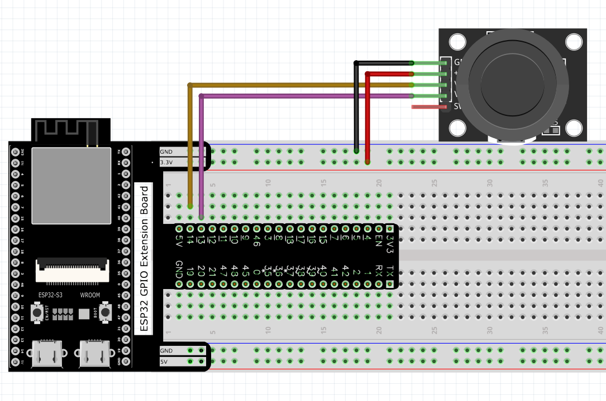

Chapter 13 Joystick
=========================
In the previous chapter, we have learned how to use rotary potentiometer. Now, 
let's learn a new electronic module joystick which working on the same principle 
as rotary potentiometer.

Project 13.1 Joystick
--------------------------
In this project, we will read the output data of a joystick and display it to the 
Terminal screen.

Component List
^^^^^^^^^^^^^^^
- ESP32-S3-WROOM x1
- GPIO Extension Board x1
- 830 Tie-Points Breadboard x1
- Joystick x1
- Jumper Wire x5

Connect
^^^^^^^^^^^

Sketch
^^^^^^^
In this project’s code, we will read the ADC values of X and Y axes of the joyst
ick, and read digital quality of the Z axis, then display these out in terminal.

**Sketch_13.1_Joystick**

.. image:: img/software/13.1.png

Download the code to ESP32-S3 WROOM, open the serial port monitor, the baud rate 
is 115200, as shown in the figure below, shift (moving) the joystick or pressing 
it down will make the data change.

Code
^^^^^^
The following is the program code:

.. code-block:: C

    int xyzPins[] = {14, 13, 12};   //x,y,z pins
    void setup() {
    Serial.begin(115200);
    pinMode(xyzPins[2], INPUT_PULLUP);  //z axis is a button.
    }

    void loop() {
    int xVal = analogRead(xyzPins[0]);
    int yVal = analogRead(xyzPins[1]);
    int zVal = digitalRead(xyzPins[2]);
    Serial.printf("X,Y,Z: %d,\t%d,\t%d\n", xVal, yVal, zVal);
    delay(500);
    }

