Chapter 25 Camera Web Server
===============================
Project 25.1 Camera Web Server
---------------------------------

Connect ESP32-S3 using USB and check its IP address through serial monitor. Use 
web page to access IP address to obtain video and image data.

Connect
^^^^^^^
Connect ESP32-S3 to the computer using the USB cable.

.. image:: img/0/connect1.png

Sketch
^^^^^^^
**Sketch_25.1_As_CameraWebServer**

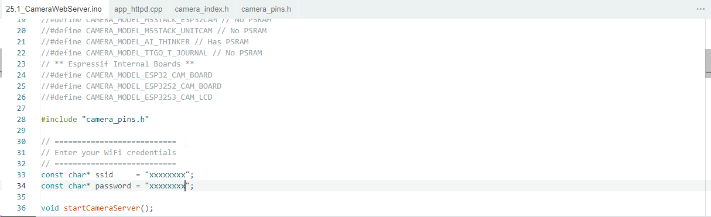

Before running the program, please modify your router’s name and password in the 
box shown in the illustration above to make sure that your Sketch can compile and 
work successfully.

Compile and upload codes to ESP32-S3, open the serial monitor and set the baud 
rate to 115200, and the serial monitor will print out a network link address.

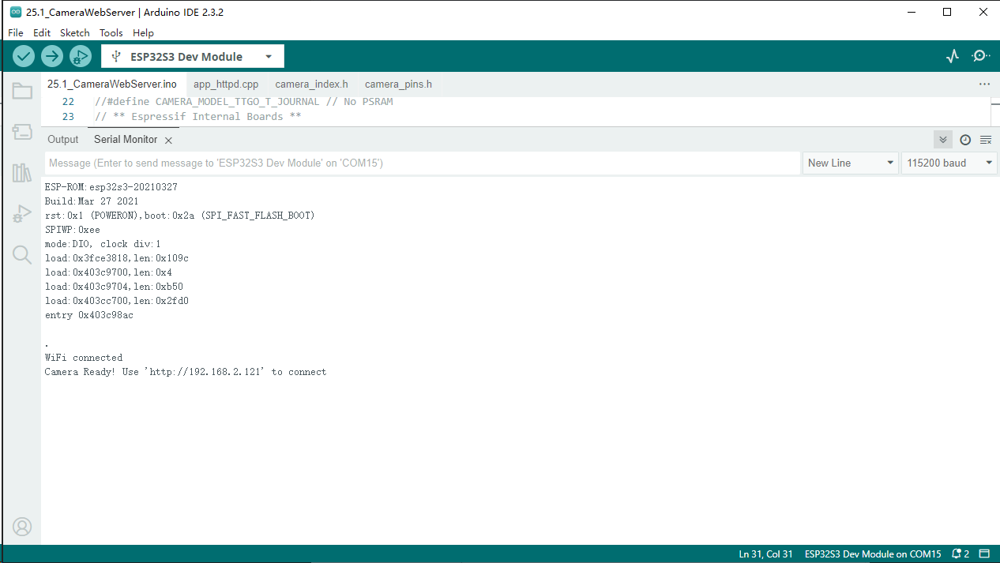

If your ESP32-S3 has been in the process of connecting to router, but the inform
ation above has not been printed out, please re-check whether the router name and 
password have been entered correctly and press the reset key on ESP32-S3 WROOM to 
wait for a successful connection prompt.

Open a web browser, enter the IP address printed by the serial monitor in the 
address bar, and access it. Taking the Google browser as an example, here's what 
the browser prints out after successful access to ESP32S3's IP.

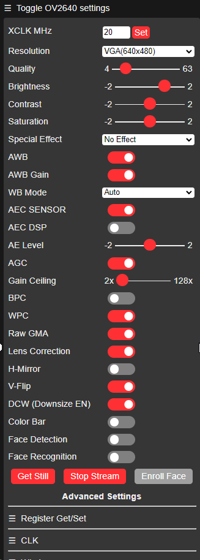

Click on Start Stream. The effect is shown in the image below. (If it feels laggy, you can lower the resolution and increase the quality setting)

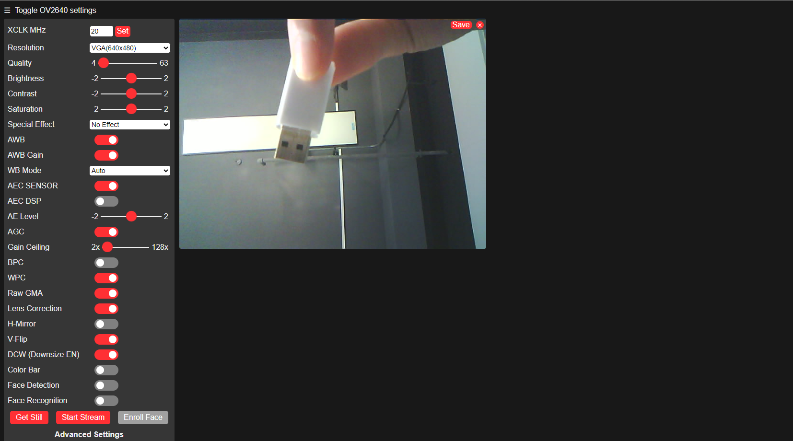

.. note:: 
    If sketch compilation fails due to ESP32-S3 support package, follow the steps of the image to open the CameraWebServer. This sketch is the same as described in the tutorial above.

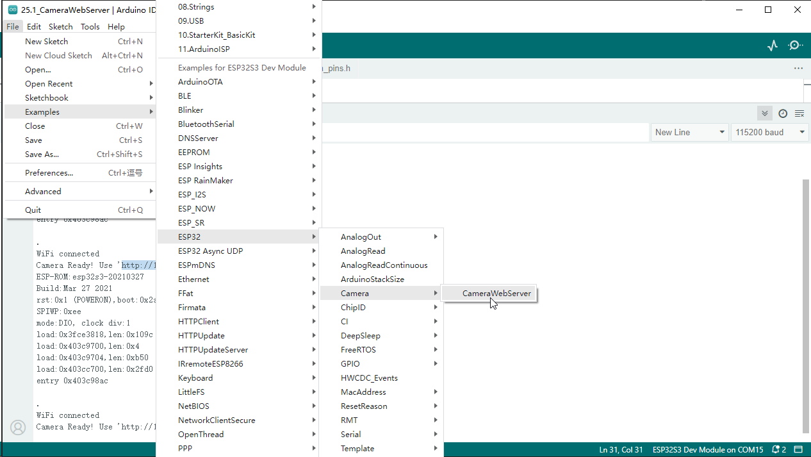

.. important::
    **Camera Module Compatibility Notice**: If you are using an **OV3660** camera module instead of the **OV2640** camera, please locate the **OV3660** folder in your code directory and use the corresponding code files. The camera model definition and pin configurations may differ between camera modules.

Code
^^^^^^
The following is the program code.You need include other code files in the same 
folder when write your own code.

.. code-block:: C

    #include "esp_camera.h"
    #include <WiFi.h>
    #include <WiFiClient.h>

    #define CAMERA_MODEL_ESP32S3_EYE
    #include "camera_pins.h"
    #define LED_BUILT_IN  2  // Built-in LED pin

    // WiFi configuration
    const char* ssid_Router     = "*********"; // Router SSID
    const char* password_Router = "*********"; // Router password

    WiFiServer server_Cmd(5000);     // Command server port 5000
    WiFiServer server_Camera(8000);  // Camera server port 8000
    TaskHandle_t cmdTaskHandle = NULL;
    TaskHandle_t blinkTaskHandle = NULL;

    void setup() {
    Serial.begin(115200);
    Serial.setDebugOutput(false);
    Serial.println();
    
    // Ultimate performance settings - for 8MB PSRAM hardware
    setCpuFrequencyMhz(240);           // Maximum CPU frequency
    
    // WiFi performance optimization
    WiFi.setTxPower(WIFI_POWER_19_5dBm); // Maximum WiFi transmission power
    
    // TCP/IP stack optimization
    WiFi.setSleep(false);              // Disable WiFi sleep to improve response speed
    
    // Initialize LED
    pinMode(LED_BUILT_IN, OUTPUT);
    digitalWrite(LED_BUILT_IN, LOW);
    
    // Initialize camera
    cameraSetup();

    // Connect to WiFi router
    Serial.printf("Connecting to %s ", ssid_Router);
    WiFi.begin(ssid_Router, password_Router);
    WiFi.setAutoReconnect(true);
    WiFi.persistent(true);
    
    // Wait for WiFi connection
    uint8_t retries = 30;
    while (WiFi.status() != WL_CONNECTED && retries--) {
        delay(500);
        Serial.print(".");
    }
    Serial.println("");
    
    if (WiFi.status() == WL_CONNECTED) {
        Serial.println("WiFi connected");
        Serial.print("Camera Ready! Use 'http://");
        Serial.print(WiFi.localIP());
        Serial.println(":8000' to connect in app.");
        
        // Start servers
        server_Camera.begin(8000);
        server_Cmd.begin(5000);
    } else {
        Serial.println("WiFi connection failed!");
    }

    // Disable core 0 watchdog timer
    disableCore0WDT();
    
    // Memory optimization - fully utilize 8MB PSRAM
    heap_caps_malloc_extmem_enable(1024); // Enable external memory allocation
    
    // Create command processing and LED blinking tasks on core 0 - using larger stack space
    xTaskCreateUniversal(loopTask_Cmd, "loopTask_Cmd", 8192, NULL, 2, &cmdTaskHandle, 0);  // Increase stack size and priority
    xTaskCreateUniversal(loopTask_Blink, "loopTask_Blink", 4096, NULL, 1, &blinkTaskHandle, 0);
    }

    // Main loop (running on core 1)
    void loop() {
    // Check WiFi connection status
    if (WiFi.status() != WL_CONNECTED) {
        Serial.println("WiFi connection lost, reconnecting...");
        WiFi.reconnect();
        // Wait for reconnection, maximum 10 seconds
        uint8_t retries = 20;
        while (WiFi.status() != WL_CONNECTED && retries--) {
        delay(500);
        Serial.print(".");
        }
        if (WiFi.status() == WL_CONNECTED) {
        Serial.println("\nReconnected to WiFi");
        }
    }

    // Accept camera client connection
    WiFiClient client = server_Camera.accept();
    if (client) {
        Serial.println("Camera Server connected to a client.");
        
        // Ultimate TCP connection optimization
        client.setNoDelay(true);           // Disable Nagle algorithm
        client.setTimeout(100);            // Reduce timeout duration
        
        uint32_t frameCount = 0;
        uint32_t startTime = millis();
        
        while (client.connected()) {
        camera_fb_t *fb = esp_camera_fb_get();
        if (fb != NULL) {
            // Send frame size
            uint32_t frameSize = fb->len;
            client.write((uint8_t*)&frameSize, 4);
            
            // Ultra-large transmission block optimization - 8MB PSRAM supports larger block transmission
            size_t sentBytes = 0;
            while (sentBytes < fb->len) {
            size_t chunkSize = min(16384, (int)(fb->len - sentBytes)); // 16KB transmission block
            size_t sent = client.write(fb->buf + sentBytes, chunkSize);
            if (sent == 0) {
                Serial.println("Send failed");
                break;
            }
            sentBytes += sent;
            }
            
            esp_camera_fb_return(fb);
            
            // Calculate and display frame rate
            frameCount++;
            if (frameCount % 30 == 0) {
            float fps = frameCount * 1000.0 / (millis() - startTime);
            Serial.printf("Stream FPS: %.2f\n", fps);
            }
        } else {
            Serial.println("Camera capture failed");
            delay(50); // Reduce delay on failure
        }
        }
        
        // Display final frame rate
        float fps = frameCount * 1000.0 / (millis() - startTime);
        Serial.printf("Stream ended. Average FPS: %.2f\n", fps);
        
        client.stop();
        Serial.println("Camera Client Disconnected.");
    }
    
    // Minimum delay to give video service more CPU time
    delay(1);
    }

    // Command processing task (running on core 0)
    void loopTask_Cmd(void *pvParameters) {
    Serial.println("Command handler task started on Core 0");
    
    while (1) {
        WiFiClient client = server_Cmd.accept();
        if (client) {
        Serial.println("Command Server connected to a client.");
        client.setNoDelay(true);
        
        while (client.connected()) {
            if (client.available()) {
            char c = client.read();
            client.write(c); // Echo received character
            Serial.write(c);
            
            // Command processing logic can be added here
            }
        }
        
        client.stop();
        Serial.println("Command Client Disconnected.");
        }
        
        // Small delay to prevent excessive CPU resource consumption
        delay(10);
    }
    }

    // LED blinking task (running on core 0)
    void loopTask_Blink(void *pvParameters) {
    Serial.println("LED blink task started on Core 0");
    
    while (1) {
        digitalWrite(LED_BUILT_IN, !digitalRead(LED_BUILT_IN)); // Toggle LED state
        delay(500); // Increase blinking frequency
    }
    }

    // Camera setup function
    void cameraSetup() {
    camera_config_t config;
    config.ledc_channel = LEDC_CHANNEL_0;
    config.ledc_timer = LEDC_TIMER_0;
    config.pin_d0 = Y2_GPIO_NUM;
    config.pin_d1 = Y3_GPIO_NUM;
    config.pin_d2 = Y4_GPIO_NUM;
    config.pin_d3 = Y5_GPIO_NUM;
    config.pin_d4 = Y6_GPIO_NUM;
    config.pin_d5 = Y7_GPIO_NUM;
    config.pin_d6 = Y8_GPIO_NUM;
    config.pin_d7 = Y9_GPIO_NUM;
    config.pin_xclk = XCLK_GPIO_NUM;
    config.pin_pclk = PCLK_GPIO_NUM;
    config.pin_vsync = VSYNC_GPIO_NUM;
    config.pin_href = HREF_GPIO_NUM;
    config.pin_sccb_sda = SIOD_GPIO_NUM;
    config.pin_sccb_scl = SIOC_GPIO_NUM;
    config.pin_pwdn = PWDN_GPIO_NUM;
    config.pin_reset = RESET_GPIO_NUM;
    
    // Ultimate performance camera parameter optimization - for 8MB PSRAM
    config.xclk_freq_hz = 24000000;        // 24MHz XCLK (highest stable frequency)
    config.frame_size = FRAMESIZE_VGA;     // 800x600 resolution (VGA restored)
    config.pixel_format = PIXFORMAT_JPEG;  // JPEG format
    config.grab_mode = CAMERA_GRAB_LATEST; // Always get latest frame
    config.fb_location = CAMERA_FB_IN_PSRAM; // Use PSRAM
    config.jpeg_quality = 25;              // Very low JPEG quality focused on frame rate
    config.fb_count = 6;                   // 6 frame buffers (balance latency and performance)
    
    // Initialize camera
    esp_err_t err = esp_camera_init(&config);
    if (err != ESP_OK) {
        Serial.printf("Camera init failed with error 0x%x", err);
        return;
    }
    
    // Ultimate sensor parameter adjustment - focus on maximum frame rate
    sensor_t * s = esp_camera_sensor_get();
    s->set_vflip(s, 0);         // Vertical flip
    s->set_brightness(s, 0);    // Default brightness
    s->set_saturation(s, -2);   // Lowest saturation to reduce processing
    s->set_contrast(s, 0);      // Default contrast
    s->set_sharpness(s, -2);    // Lowest sharpness to reduce processing
    s->set_denoise(s, 0);       // Turn off noise reduction
    s->set_quality(s, 25);      // Very low JPEG quality focused on maximum frame rate
    s->set_gainceiling(s, (gainceiling_t)6); // Gain ceiling
    s->set_agc_gain(s, 0);      // Disable automatic gain control
    s->set_aec_value(s, 300);   // Fixed exposure value
    s->set_special_effect(s, 0); // No special effects processing
    
    Serial.println("Camera configuration complete!");
    }

Project 25.2 Video Web Server
----------------------------------
Connect to ESP32-S3 using USB and view its IP address through a serial monitor. 
Access IP addresses through web pages to obtain real-time video data.

Component List
^^^^^^^^^^^^^^^
- ESP32-S3-WROOM x1
- Type C USB Cable x1
- Memory Card x1

Connect
^^^^^^^
Connect ESP32-S3 to the computer using the USB cable.

.. image:: img/0/connect1.png

Sketch
^^^^^^^
**Sketch_25.2_As_VideoWebServer**

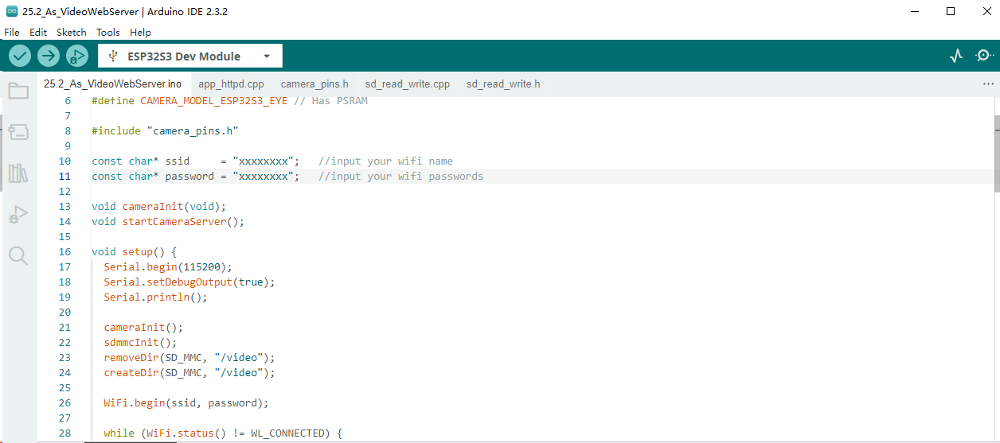

Before running the program, please modify your router’s name and password in the 
box shown in the illustration above to make sure that your Sketch can compile and 
work successfully.

Compile and upload codes to ESP32-S3, open the serial monitor and set the baud 
rate to 115200, and the serial monitor will print out a network link address.

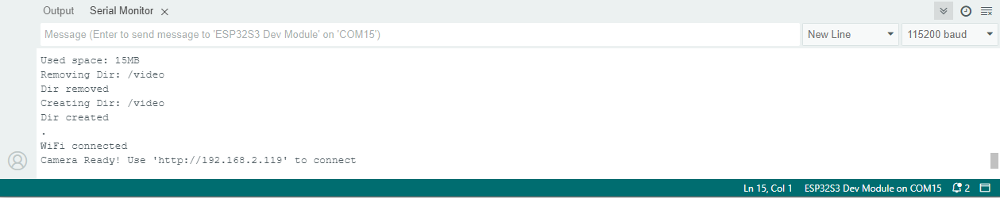

If your ESP32-S3 has been in the process of connecting to router, but the inform
ation above has not been printed out, please re-check whether the router name and 
password have been entered correctly and press the reset key on ESP32-S3 WROOM to 
wait for a successful connection prompt.

Open a web browser, enter the IP address printed by the serial monitor in the 
address bar, and access it. Taking the Google browser as an example, here's what 
the browser prints out after successful access to ESP32S3's IP.

The effect is shown in the image below.

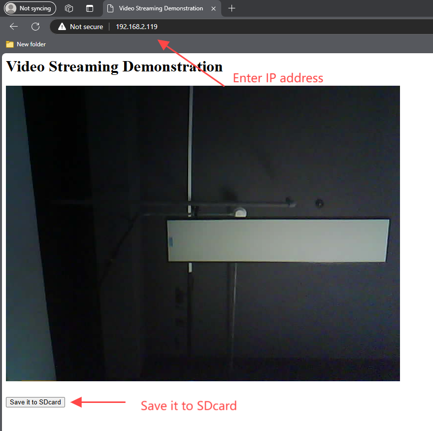

.. important::
    **Camera Module Compatibility Notice**: If you are using an **OV3660** camera module instead of the **OV2640** camera, please locate the **OV3660** folder in your code directory and use the corresponding code files. The camera model definition and pin configurations may differ between camera modules.

Code
^^^^^^
The following is the main program code. You need include other code files in the same folder when write your own code.

.. code-block:: C

    #include "esp_camera.h"
    #include <WiFi.h>
    #include "sd_read_write.h"

    // Select camera model
    #define CAMERA_MODEL_ESP32S3_EYE // Has PSRAM

    #include "camera_pins.h"

    const char* ssid     = "*********";   //input your wifi name
    const char* password = "*********";   //input your wifi passwords

    void cameraInit(void);
    void startCameraServer();

    void setup() {
      Serial.begin(115200);
      Serial.setDebugOutput(true);
      Serial.println();

      cameraInit();
      sdmmcInit();
      removeDir(SD_MMC, "/video");
      createDir(SD_MMC, "/video");
      
      WiFi.begin(ssid, password);

      while (WiFi.status() != WL_CONNECTED) {
        delay(500);
        Serial.print(".");
      }
      Serial.println("");
      Serial.println("WiFi connected");

      startCameraServer();

      Serial.print("Camera Ready! Use 'http://");
      Serial.print(WiFi.localIP());
      Serial.println("' to connect");
    }

    void loop() {
      // put your main code here, to run repeatedly:
      delay(10000);
    }

    void cameraInit(void){
      camera_config_t config;
      config.ledc_channel = LEDC_CHANNEL_0;
      config.ledc_timer = LEDC_TIMER_0;
      config.pin_d0 = Y2_GPIO_NUM;
      config.pin_d1 = Y3_GPIO_NUM;
      config.pin_d2 = Y4_GPIO_NUM;
      config.pin_d3 = Y5_GPIO_NUM;
      config.pin_d4 = Y6_GPIO_NUM;
      config.pin_d5 = Y7_GPIO_NUM;
      config.pin_d6 = Y8_GPIO_NUM;
      config.pin_d7 = Y9_GPIO_NUM;
      config.pin_xclk = XCLK_GPIO_NUM;
      config.pin_pclk = PCLK_GPIO_NUM;
      config.pin_vsync = VSYNC_GPIO_NUM;
      config.pin_href = HREF_GPIO_NUM;
      config.pin_sccb_sda = SIOD_GPIO_NUM;
      config.pin_sccb_scl = SIOC_GPIO_NUM;
      config.pin_pwdn = PWDN_GPIO_NUM;
      config.pin_reset = RESET_GPIO_NUM;
      config.xclk_freq_hz = 20000000;
      config.frame_size = FRAMESIZE_UXGA;
      config.pixel_format = PIXFORMAT_JPEG; // for streaming
      config.grab_mode = CAMERA_GRAB_WHEN_EMPTY;
      config.fb_location = CAMERA_FB_IN_PSRAM;
      config.jpeg_quality = 8;
      config.fb_count = 1;
      
      // if PSRAM IC present, init with UXGA resolution and higher JPEG quality
      // for larger pre-allocated frame buffer.
      if(psramFound()){
        config.jpeg_quality = 10;
        config.fb_count = 2;
        config.grab_mode = CAMERA_GRAB_LATEST;
      } else {
        // Limit the frame size when PSRAM is not available
        config.frame_size = FRAMESIZE_VGA;
        config.fb_location = CAMERA_FB_IN_DRAM;
      }

      // camera init
      esp_err_t err = esp_camera_init(&config);
      if (err != ESP_OK) {
        Serial.printf("Camera init failed with error 0x%x", err);
        return;
      }

      sensor_t * s = esp_camera_sensor_get();
      s->set_vflip(s, 0); // Set to 1 to flip vertically (fix upside-down)
      s->set_hmirror(s, 0); // Set to 1 to flip horizontally (fix left-right mirror)
      s->set_brightness(s, 1); // up the brightness just a bit
      s->set_saturation(s, 0); // lower the saturation
    }

Project 25.3 Camera and SDcard
-------------------------------
In this chapter, we continue to use the camera and SD card. We will use the onboa
rd button as the shutter. When the button is pressed, the ESP32-S3 takes a photo 
and stores the photo in the SD folder.

Component List
^^^^^^^^^^^^^^^
- ESP32-S3-WROOM x1
- Type C USB Cable x1
- Memory Card x1

Connect
^^^^^^^
Connect ESP32-S3 to the computer using the USB cable.

.. image:: img/0/connect1.png

Sketch
^^^^^^^
Make sure your project folder contains the following images. These headers files make 
sure this program works

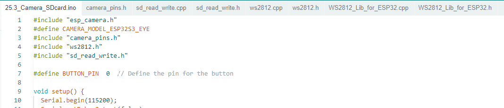

**Sketch_25.3_Camera_SDcard**

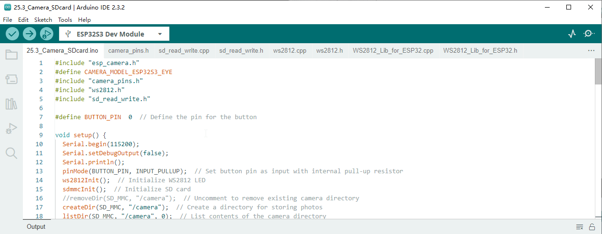

Compile and upload the code to the ESP32-S3. If your camera is not installed pro
perly, causing the camera to fail to initialize, or you have not inserted the SD 
card into the ESP32-S3 in advance, the on-board colored lights will turn on red 
as a reminder. If all is well, the onboard colored light will light up green. When 
the onboard BOOT button is pressed, the ESP32-S3 will capture the current camera 
image and save it in the "Camera" folder of the SD card. At the same time, the 
onboard LED lights up blue, and returns to green after taking a photo.

As shown in the image below, after uploading the code to the ESP32-S3, the ESP32
-S3 will automatically create a folder named "camera" in the SD card. Every time 
the BOOT button is pressed, the on-board colored light turns on blue, and ESP32-S3 
collects a photo information and stores it in the "camera" folder. Press the but
ton once to take a photo. When we press the RST button to reset the ESP32-S3, we 
can see that there are some photo files in the SD card folder. These photos you 
can read directly through the card reader.

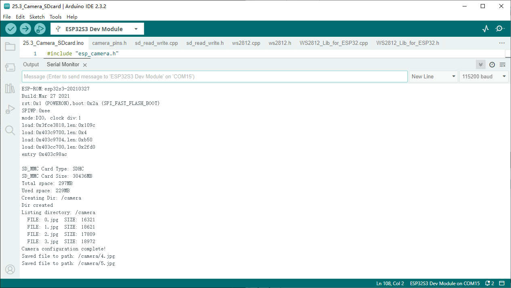

.. important::
    **Camera Module Compatibility Notice**: If you are using an **OV3660** camera module instead of the **OV2640** camera, please locate the **OV3660** folder in your code directory and use the corresponding code files. The camera model definition and pin configurations may differ between camera modules.

Code
^^^^^^
The following is the main program code. You need include other code files in the 
same folder when write your own code.

.. code-block:: C

    #include "esp_camera.h"
    #define CAMERA_MODEL_ESP32S3_EYE
    #include "camera_pins.h"
    #include "ws2812.h"
    #include "sd_read_write.h"

    #define BUTTON_PIN  0  // Define the pin for the button

    void setup() {
    Serial.begin(115200);
    Serial.setDebugOutput(false);
    Serial.println();
    pinMode(BUTTON_PIN, INPUT_PULLUP);
    ws2812Init();  // Initialize WS2812 LED
    
    // Initialize SD card
    sdmmcInit();
    if (!SD_MMC.begin()) {  // Check if SD card is successfully mounted
        ws2812SetColor(1);  // SD card initialization failed, set red light
        Serial.println("SD card initialization failed");
        return;  // If SD card is necessary, you can return here
    }
    
    createDir(SD_MMC, "/camera");
    listDir(SD_MMC, "/camera", 0);
    
    if (cameraSetup() == 1) {
        ws2812SetColor(2);  // Camera setup successful, set green light
    } else {
        ws2812SetColor(1);  // Camera setup failed, set red light
        Serial.println("Camera setup failed");
        return;
    }
    }

    void loop() {
    if(digitalRead(BUTTON_PIN)==LOW){  // Check if button is pressed
        delay(20);  // Debounce delay
        if(digitalRead(BUTTON_PIN)==LOW){
            ws2812SetColor(3);  // Set LED color to indicate photo capture in progress
        while(digitalRead(BUTTON_PIN)==LOW);  // Wait for button release
        camera_fb_t * fb = NULL;
        fb = esp_camera_fb_get();  // Capture a photo
        if (fb != NULL) {
            int photo_index = readFileNum(SD_MMC, "/camera");  // Get the next file number
            if(photo_index!=-1)
            {
            String path = "/camera/" + String(photo_index) +".jpg";
            writejpg(SD_MMC, path.c_str(), fb->buf, fb->len);  // Save the photo to SD card
            }
            esp_camera_fb_return(fb);  // Return the frame buffer to be reused
        }
        else {
            Serial.println("Camera capture failed.");
        }
        ws2812SetColor(2);  // Set LED color back to indicate ready state
        }
    }
    }

    int cameraSetup(void) {
    camera_config_t config;
    config.ledc_channel = LEDC_CHANNEL_0;
    config.ledc_timer = LEDC_TIMER_0;
    config.pin_d0 = Y2_GPIO_NUM;
    config.pin_d1 = Y3_GPIO_NUM;
    config.pin_d2 = Y4_GPIO_NUM;
    config.pin_d3 = Y5_GPIO_NUM;
    config.pin_d4 = Y6_GPIO_NUM;
    config.pin_d5 = Y7_GPIO_NUM;
    config.pin_d6 = Y8_GPIO_NUM;
    config.pin_d7 = Y9_GPIO_NUM;
    config.pin_xclk = XCLK_GPIO_NUM;
    config.pin_pclk = PCLK_GPIO_NUM;
    config.pin_vsync = VSYNC_GPIO_NUM;
    config.pin_href = HREF_GPIO_NUM;
    config.pin_sccb_sda = SIOD_GPIO_NUM;
    config.pin_sccb_scl = SIOC_GPIO_NUM;
    config.pin_pwdn = PWDN_GPIO_NUM;
    config.pin_reset = RESET_GPIO_NUM;
    config.xclk_freq_hz = 20000000;
    config.frame_size = FRAMESIZE_UXGA;
    config.pixel_format = PIXFORMAT_JPEG; // for streaming
    config.grab_mode = CAMERA_GRAB_WHEN_EMPTY;
    config.fb_location = CAMERA_FB_IN_PSRAM;
    config.jpeg_quality = 12;
    config.fb_count = 1;
    
    // if PSRAM IC present, init with UXGA resolution and higher JPEG quality
    // for larger pre-allocated frame buffer.
    if(psramFound()){
        config.jpeg_quality = 10;
        config.fb_count = 2;
        config.grab_mode = CAMERA_GRAB_LATEST;
    } else {
        // Limit the frame size when PSRAM is not available
        config.frame_size = FRAMESIZE_SVGA;
        config.fb_location = CAMERA_FB_IN_DRAM;
    }

    // camera init
    esp_err_t err = esp_camera_init(&config);
    if (err != ESP_OK) {
        Serial.printf("Camera init failed with error 0x%x", err);
        return 0;
    }

    sensor_t * s = esp_camera_sensor_get();
    // initial sensors are flipped vertically and colors are a bit saturated
    s->set_vflip(s, 1); // flip it back
    s->set_brightness(s, 1); // up the brightness just a bit
    s->set_saturation(s, 0); // lower the saturation

    Serial.println("Camera configuration complete!");
    return 1;
    }

