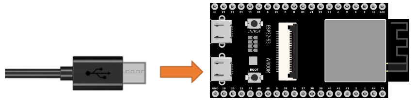

Chapter 26 Camera Tcp Server
==============================
In the previous section, we used web page to display the video data captured by 
ESP32-S3, and in this section, we will use a mobile phone to display it.

Project 26.1 Camera Tcp Server
--------------------------------
Connect ESP32-S3 using USB and check its IP address through serial monitor. Use 
a mobile phone to obtain video and image data.

Connect
^^^^^^^
Connect ESP32-S3 to the computer using the USB cable.

Sketch
^^^^^^^
First, you need to download the RaspPICar APP installation package from this 
address and manually install it on your Android phone.

`RaspPICar App <https://www.dropbox.com/scl/fo/vbwll6vgk9h5bo036g45q/AHH2STGDT-9w2qvV967ypI8?rlkey=u094s4bloaymovt0k4tscrr9i&e=1&st=eb22cjfn&dl=0>`_

Then, when you open RaspPICar on your phone, this interface will be displayed.

After making sure the Tools is configured correctly, don’t run Sketch. Due to 
WiFi, we need to modify Sketch a little bit based on physical situation.

Fill in your router's SSID and password in the quotes after ssid_Router and password_Router in the image above. After setting correctly, compile and upload to ESP32-S3.
Open the serial monitor and press the reset button on the Raspberry Pi, the serial monitor will print out an IP address.

First, connect your phone to your router to ensure it's on the same local network. Then open the RaspPICar app and enter the IP address printed by the serial monitor in the IP input box in the upper left corner. Click the connect button, and after successful connection, a video stream will be displayed as shown in the figure below

.. important::
    **Camera Module Compatibility Notice**: If you are using an **OV3660** camera module instead of the **OV2640** camera, please locate the **OV3660** folder in your code directory and use the corresponding code files. The camera model definition and pin configurations may differ between camera modules.
    
Code
^^^^^^
The following is the program code.You need include other code files in the same 
folder when write your own code.
**Sketch_26.1_Camera_Tcp_Server**

.. code-block:: C

    #include "esp_camera.h"
    #include <WiFi.h>
    #include <WiFiClient.h>

    #define CAMERA_MODEL_ESP32S3_EYE
    #include "camera_pins.h"
    #define LED_BUILT_IN  2  // Built-in LED pin

    // WiFi configuration
    const char* ssid_Router     = "*********"; // Router SSID
    const char* password_Router = "*********"; // Router password

    WiFiServer server_Cmd(5000);     // Command server port 5000
    WiFiServer server_Camera(8000);  // Camera server port 8000
    TaskHandle_t cmdTaskHandle = NULL;
    TaskHandle_t blinkTaskHandle = NULL;

    void setup() {
    Serial.begin(115200);
    Serial.setDebugOutput(false);
    Serial.println();
    
    // Ultimate performance settings - for 8MB PSRAM hardware
    setCpuFrequencyMhz(240);           // Maximum CPU frequency
    
    // WiFi performance optimization
    WiFi.setTxPower(WIFI_POWER_19_5dBm); // Maximum WiFi transmission power
    
    // TCP/IP stack optimization
    WiFi.setSleep(false);              // Disable WiFi sleep to improve response speed
    
    // Initialize LED
    pinMode(LED_BUILT_IN, OUTPUT);
    digitalWrite(LED_BUILT_IN, LOW);
    
    // Initialize camera
    cameraSetup();

    // Connect to WiFi router
    Serial.printf("Connecting to %s ", ssid_Router);
    WiFi.begin(ssid_Router, password_Router);
    WiFi.setAutoReconnect(true);
    WiFi.persistent(true);
    
    // Wait for WiFi connection
    uint8_t retries = 30;
    while (WiFi.status() != WL_CONNECTED && retries--) {
        delay(500);
        Serial.print(".");
    }
    Serial.println("");
    
    if (WiFi.status() == WL_CONNECTED) {
        Serial.println("WiFi connected");
        Serial.print("Camera Ready! Use 'http://");
        Serial.print(WiFi.localIP());
        Serial.println(":8000' to connect in app.");
        
        // Start servers
        server_Camera.begin(8000);
        server_Cmd.begin(5000);
    } else {
        Serial.println("WiFi connection failed!");
    }

    // Disable core 0 watchdog timer
    disableCore0WDT();
    
    // Memory optimization - fully utilize 8MB PSRAM
    heap_caps_malloc_extmem_enable(1024); // Enable external memory allocation
    
    // Create command processing and LED blinking tasks on core 0 - using larger stack space
    xTaskCreateUniversal(loopTask_Cmd, "loopTask_Cmd", 8192, NULL, 2, &cmdTaskHandle, 0);  // Increase stack size and priority
    xTaskCreateUniversal(loopTask_Blink, "loopTask_Blink", 4096, NULL, 1, &blinkTaskHandle, 0);
    }

    // Main loop (running on core 1)
    void loop() {
    // Check WiFi connection status
    if (WiFi.status() != WL_CONNECTED) {
        Serial.println("WiFi connection lost, reconnecting...");
        WiFi.reconnect();
        // Wait for reconnection, maximum 10 seconds
        uint8_t retries = 20;
        while (WiFi.status() != WL_CONNECTED && retries--) {
        delay(500);
        Serial.print(".");
        }
        if (WiFi.status() == WL_CONNECTED) {
        Serial.println("\nReconnected to WiFi");
        }
    }

    // Accept camera client connection
    WiFiClient client = server_Camera.accept();
    if (client) {
        Serial.println("Camera Server connected to a client.");
        
        // Ultimate TCP connection optimization
        client.setNoDelay(true);           // Disable Nagle algorithm
        client.setTimeout(100);            // Reduce timeout duration
        
        uint32_t frameCount = 0;
        uint32_t startTime = millis();
        
        while (client.connected()) {
        camera_fb_t *fb = esp_camera_fb_get();
        if (fb != NULL) {
            // Send frame size
            uint32_t frameSize = fb->len;
            client.write((uint8_t*)&frameSize, 4);
            
            // Ultra-large transmission block optimization - 8MB PSRAM supports larger block transmission
            size_t sentBytes = 0;
            while (sentBytes < fb->len) {
            size_t chunkSize = min(16384, (int)(fb->len - sentBytes)); // 16KB transmission block
            size_t sent = client.write(fb->buf + sentBytes, chunkSize);
            if (sent == 0) {
                Serial.println("Send failed");
                break;
            }
            sentBytes += sent;
            }
            
            esp_camera_fb_return(fb);
            
            // Calculate and display frame rate
            frameCount++;
            if (frameCount % 30 == 0) {
            float fps = frameCount * 1000.0 / (millis() - startTime);
            Serial.printf("Stream FPS: %.2f\n", fps);
            }
        } else {
            Serial.println("Camera capture failed");
            delay(50); // Reduce delay on failure
        }
        }
        
        // Display final frame rate
        float fps = frameCount * 1000.0 / (millis() - startTime);
        Serial.printf("Stream ended. Average FPS: %.2f\n", fps);
        
        client.stop();
        Serial.println("Camera Client Disconnected.");
    }
    
    // Minimum delay to give video service more CPU time
    delay(1);
    }

    // Command processing task (running on core 0)
    void loopTask_Cmd(void *pvParameters) {
    Serial.println("Command handler task started on Core 0");
    
    while (1) {
        WiFiClient client = server_Cmd.accept();
        if (client) {
        Serial.println("Command Server connected to a client.");
        client.setNoDelay(true);
        
        while (client.connected()) {
            if (client.available()) {
            char c = client.read();
            client.write(c); // Echo received character
            Serial.write(c);
            
            // Command processing logic can be added here
            }
        }
        
        client.stop();
        Serial.println("Command Client Disconnected.");
        }
        
        // Small delay to prevent excessive CPU resource consumption
        delay(10);
    }
    }

    // LED blinking task (running on core 0)
    void loopTask_Blink(void *pvParameters) {
    Serial.println("LED blink task started on Core 0");
    
    while (1) {
        digitalWrite(LED_BUILT_IN, !digitalRead(LED_BUILT_IN)); // Toggle LED state
        delay(500); // Increase blinking frequency
    }
    }

    // Camera setup function
    void cameraSetup() {
    camera_config_t config;
    config.ledc_channel = LEDC_CHANNEL_0;
    config.ledc_timer = LEDC_TIMER_0;
    config.pin_d0 = Y2_GPIO_NUM;
    config.pin_d1 = Y3_GPIO_NUM;
    config.pin_d2 = Y4_GPIO_NUM;
    config.pin_d3 = Y5_GPIO_NUM;
    config.pin_d4 = Y6_GPIO_NUM;
    config.pin_d5 = Y7_GPIO_NUM;
    config.pin_d6 = Y8_GPIO_NUM;
    config.pin_d7 = Y9_GPIO_NUM;
    config.pin_xclk = XCLK_GPIO_NUM;
    config.pin_pclk = PCLK_GPIO_NUM;
    config.pin_vsync = VSYNC_GPIO_NUM;
    config.pin_href = HREF_GPIO_NUM;
    config.pin_sccb_sda = SIOD_GPIO_NUM;
    config.pin_sccb_scl = SIOC_GPIO_NUM;
    config.pin_pwdn = PWDN_GPIO_NUM;
    config.pin_reset = RESET_GPIO_NUM;
    
    // Ultimate performance camera parameter optimization - for 8MB PSRAM
    config.xclk_freq_hz = 24000000;        // 24MHz XCLK (highest stable frequency)
    config.frame_size = FRAMESIZE_VGA;     // 800x600 resolution (VGA restored)
    config.pixel_format = PIXFORMAT_JPEG;  // JPEG format
    config.grab_mode = CAMERA_GRAB_LATEST; // Always get latest frame
    config.fb_location = CAMERA_FB_IN_PSRAM; // Use PSRAM
    config.jpeg_quality = 25;              // Very low JPEG quality focused on frame rate
    config.fb_count = 6;                   // 6 frame buffers (balance latency and performance)
    
    // Initialize camera
    esp_err_t err = esp_camera_init(&config);
    if (err != ESP_OK) {
        Serial.printf("Camera init failed with error 0x%x", err);
        return;
    }
    
    // Ultimate sensor parameter adjustment - focus on maximum frame rate
    sensor_t * s = esp_camera_sensor_get();
    s->set_vflip(s, 0);         // Vertical flip
    s->set_brightness(s, 0);    // Default brightness
    s->set_saturation(s, -2);   // Lowest saturation to reduce processing
    s->set_contrast(s, 0);      // Default contrast
    s->set_sharpness(s, -2);    // Lowest sharpness to reduce processing
    s->set_denoise(s, 0);       // Turn off noise reduction
    s->set_quality(s, 25);      // Very low JPEG quality focused on maximum frame rate
    s->set_gainceiling(s, (gainceiling_t)6); // Gain ceiling
    s->set_agc_gain(s, 0);      // Disable automatic gain control
    s->set_aec_value(s, 300);   // Fixed exposure value
    s->set_special_effect(s, 0); // No special effects processing
    
    Serial.println("Camera configuration complete!");
    }

