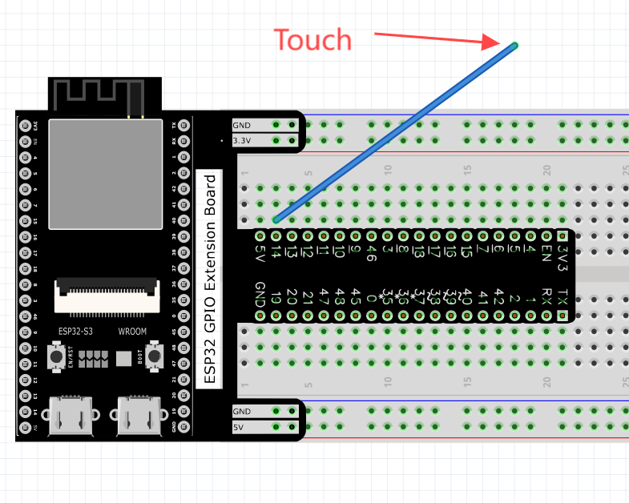
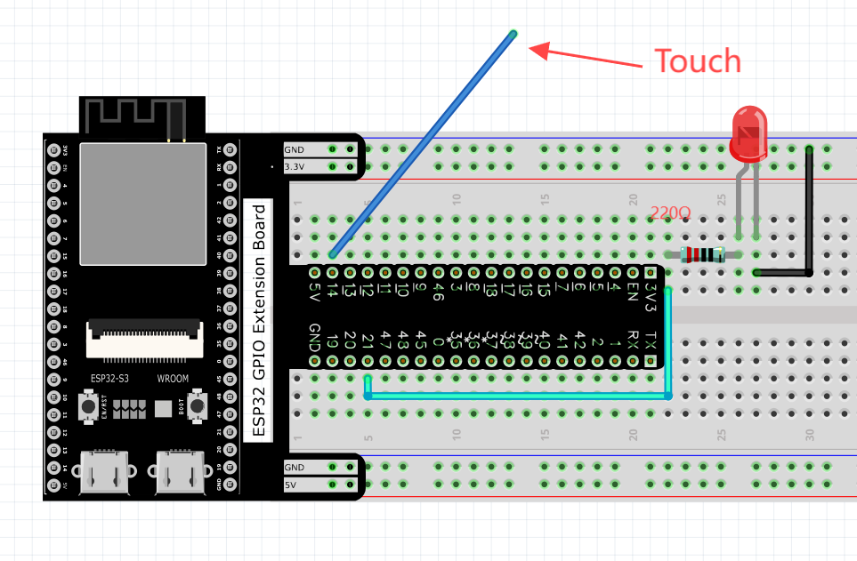
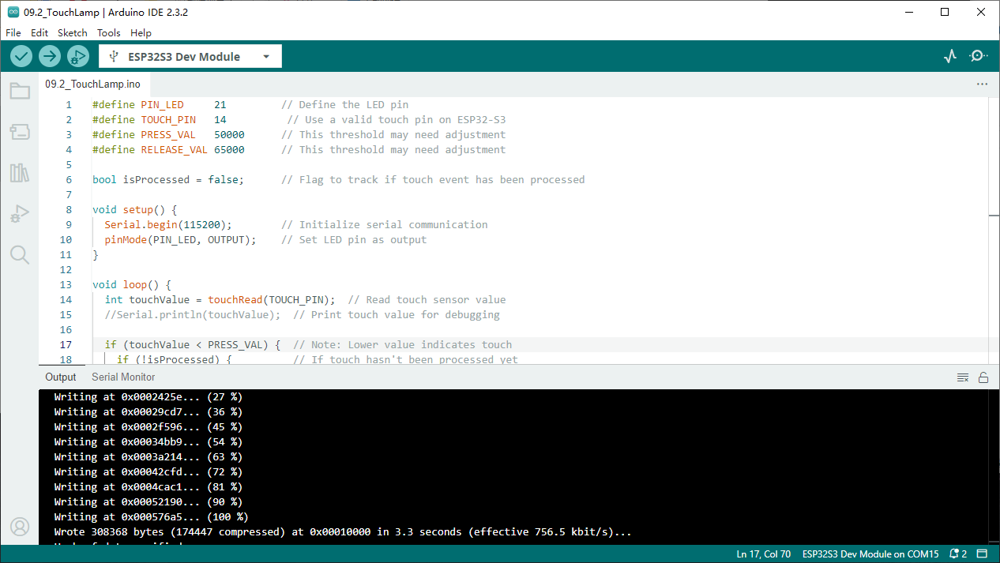

Chapter 9 Touch Sensor
=========================
ESP32-S3 offers up to 14 capacitive touch GPIO, and as you can see from the previous 
section, mechanical switches are prone to jitter that must be eliminated when used, 
which is not the case with ESP32-S3's builtin touch sensor. In addition, on the 
service life, the touch switch also has advantages that mechanical switch is completely 
incomparable.

Project 9.1 Read Touch Sensor
------------------------------------
This project reads the value of the touch sensor and prints it out.

Component List
^^^^^^^^^^^^^^^
- ESP32-S3-WROOM x1
- GPIO Extension Board x1
- 830 Tie-Points Breadboard x1
- Jumper Wire x1
  
Connect
^^^^^^^^^^^

Sketch
^^^^^^^
**Sketch_09.1_TouchRead**

Download the code to ESP32-S3 WROOM, open the serial monitor, and set the baud 
rate to 115200. Touch jumper with hand. As shown in the following figure

Project 9.2 Touch Lamp
---------------------------
In this project, we will use ESP32-S3's touch sensor to create a touch switch lamp.

Component List
^^^^^^^^^^^^^^^
- ESP32-S3-WROOM x1
- GPIO Extension Board x1
- 830 Tie-Points Breadboard x1
- LED x1
- Resistor 220Ω x1
- Jumper Wire x3
  
Connect
^^^^^^^

Sketch
^^^^^^^
**Sketch_09.2_TouchLamp**

    
Download the code to ESP32-S3 WROOM, open the serial monitor, and set the baud 
rate to 115200. Touch jumper with hand. As shown in the following figure,

With a touch pad, the state of the LED changes with each touch, and the detection 
state of the touch sensor is printed in the serial monitor.

Code
^^^^^^
The following is the program code:

.. code-block:: C

    #define PIN_LED     21
    #define PRESS_VAL   200000	  //Set a threshold to judge touch
    #define RELEASE_VAL 60000	    //Set a threshold to judge release

    bool isProcessed = false;
    void setup() {
    Serial.begin(115200);
    pinMode(PIN_LED, OUTPUT);
    }
    void loop() {
    if (touchRead(T14) > PRESS_VAL) {
        if (!isProcessed) {
        isProcessed = true;
        Serial.println("Touch detected! ");
        reverseGPIO(PIN_LED);
        }
    }
    if (touchRead(T14) < RELEASE_VAL) {
        if (isProcessed) {
        isProcessed = false;
        Serial.println("Released! ");
        }
    }
    }

    void reverseGPIO(int pin) {
    digitalWrite(pin, !digitalRead(pin));
    }

