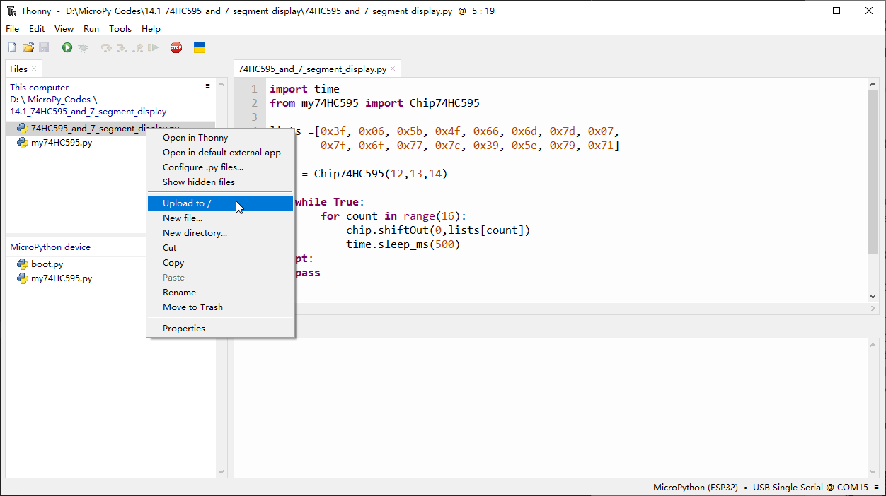
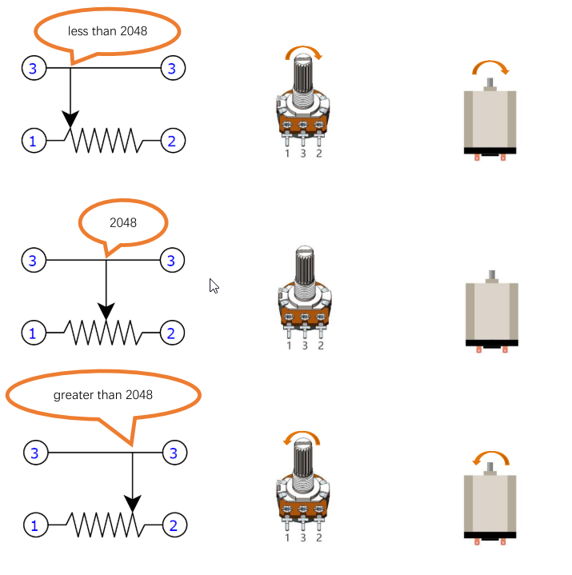

Chapter 14 74HC595 & 7-Segment Display
=================================================
In this chapter, we will introduce the 7-Segment Display.

Project 14.1 7-Segment Display.
------------------------------------
We will use 74HC595 to control 7-segment display and make it display hexadecimal 
character "0-F".

Component List
^^^^^^^^^^^^^^^
- ESP32-S3-WROOM x1
- GPIO Extension Board x1
- 830 Tie-Points Breadboard x1
- 74HC595 x1
- Resistor 220Ω x8
- 1 Dight 7-segment Display x1
- Jumper Wire 

Connect
^^^^^^^^

Code
^^^^^^^
In this section, the 74HC595 is used in the same way as in the previous section, 
but with different values transferred. We can learn how to master the digital d
isplay by sending the code value of "0" - "F". Move the program folder “Freenov
e_Super_Starter_Kit_for_ESP32_S3/Python/Python_Codes” to disk(D) in advance wit
h the path of “D:/Micropython_Codes”.

Open “Thonny”, click “This computer” >> “D:” >> “Micropython_Codes” >> “14.1_74HC59
5_and_7_segment_display”.

Select “my74HC595.py”, right click your mouse to select “Upload to /”, wait for 
“my74HC595.py” to be uploaded to ESP32-S3 and then double click“74HC595_and_7_se
gment_display.py”.

**14.1_74HC595_and_7_segment_display**

Click “Run current script”，and you'll see a 1-bit, 7-segment display displaying 
0-f in a loop.

Code
^^^^^^
The following is the program code:

.. code-block:: python

    import time
    from my74HC595 import Chip74HC595

    lists =[0xc0, 0xf9, 0xa4, 0xb0, 0x99, 0x92, 0x82, 0xf8,
            0x80, 0x90, 0x88, 0x83, 0xc6, 0xa1, 0x86, 0x8e]

    chip = Chip74HC595(12,13,14)
    try:
        while True:
            for count in range(16):
                chip.shiftOut(0,lists[count])
                time.sleep_ms(500)
    except:
        pass

